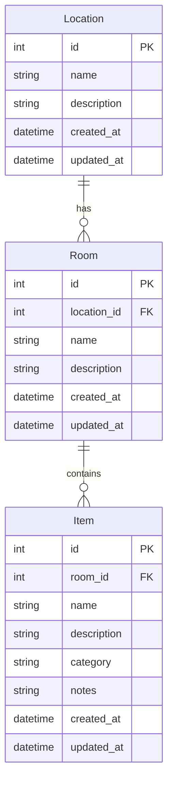

# ClutterStock – Entity Relationship Diagram

## Relationships

| From   | To     | Cardinality | Description                    |
|--------|--------|-------------|--------------------------------|
| Location | Room  | 1 : N       | One location has many rooms.   |
| Room   | Item   | 1 : N       | One room contains many items.  |

## Notes

- **Location**: Top-level place (e.g. "Home", "Garage", "Storage unit").
- **Room**: Room or zone within a location (e.g. "Garage – workbench", "Office").
- **Item**: Stored thing (electronics, parts, homelab gear, etc.).
